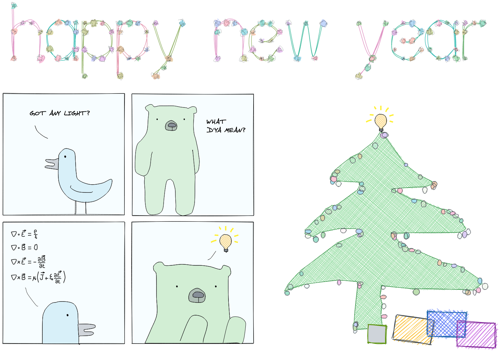
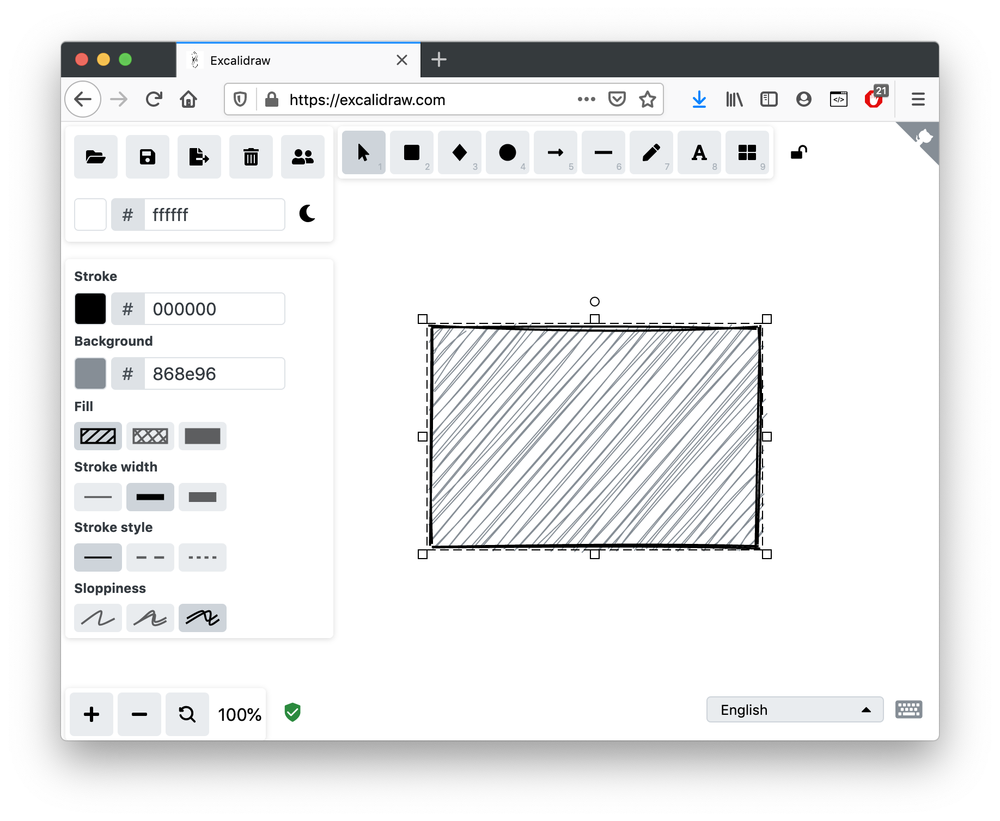

<!-- README.md is generated from README.Rmd. Please edit that file -->

```{r, include = FALSE}
knitr::opts_chunk$set(
  collapse = TRUE,
  comment = "  ",
  fig.path = "man/figures/README-",
  out.width = "100%"
)

library(minixcali)
# knitr::include_graphics('man/figures/preview.png')
```



See live at: https://excalidraw.com/#json=6574685261135872,GxSfukqmhssGOdgZvNhG-g

## Usage

```{r, include = TRUE, eval=TRUE}
library(minixcali)

d <- Excali_doc()
shape <- xkd_rectangle(width = 300, height=200,
                       fillStyle = 'hachure', roughness = 2)
d$add(shape)
d$export(file = file.path(tempdir(), 'output.json'))

```

Imported into Excalidraw: https://excalidraw.com/#json=5715677440638976,p-zr2_oejToaWyr7Slr44w




## Acknowledgments

- [Excalidraw](https://excalidraw.com/) for this cool & open interactive tool

- [`{minisvg}`](https://coolbutuseless.github.io/package/minisvg/) by @coolbutuseless — the R6 model was too complicated for me to copy properly so I settled for a dumb list structure `¯\_(ツ)_/¯` 

- [`{jsonlite}`](https://CRAN.R-project.org/package=jsonlite) to import/export R objects to JSON

- [`{purrr}`, `{tibble}`, `{glue}`](https://www.tidyverse.org/) for making the initial digressions in development somewhat less terrible

- [`{svgchop}`](https://github.com/brodieG/svgchop) by @brodieG to import SVG paths

- [`{flametree}`](https://flametree.djnavarro.net/) for providing a pretty example [to play with](https://baptiste.github.io/minixcali/articles/FlameTree.html)

- [`ln` (golang)](https://godoc.org/github.com/fogleman/ln/ln) for cool SVGs [to import](https://baptiste.github.io/minixcali/articles/SvgChop.html)

- [poorlydrawnlines](http://www.poorlydrawnlines.com/) for Kevin and Roberto

- [`{isoband}`](https://wilkelab.org/isoband/) to melt Excalidraw with volcanos

- [`{gridfont}`](https://github.com/coolbutuseless/gridfont) by @coolbutuseless, to draw text as single line strokes

- [`{excalidrawr}`](https://github.com/timelyportfolio/excalidrawr) by @timelyportfolio for the experimental Shiny wrapper around Excalidraw's React component (hopefully this will help provide a live-preview)


