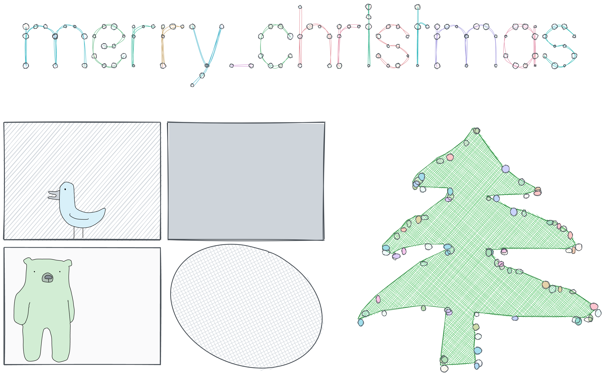

<!-- README.md is generated from README.Rmd. Please edit that file -->

```{r, include = FALSE}
knitr::opts_chunk$set(
  collapse = TRUE,
  comment = "  ",
  fig.path = "man/figures/README-",
  out.width = "100%"
)

library(minixcali)
# 
```


https://excalidraw.com/#json=5711173496340480,eQSvgvxy8AjKeGWJz1CfVQ

## Usage

```{r, include = TRUE, eval=TRUE}
library(minixcali)

d <- Excali_doc()
shape <- xkd_rectangle(width = 300, height=200,
                       fillStyle = 'hachure', roughness = 2)
d$add(shape)
d$export(file='output.json')

```
