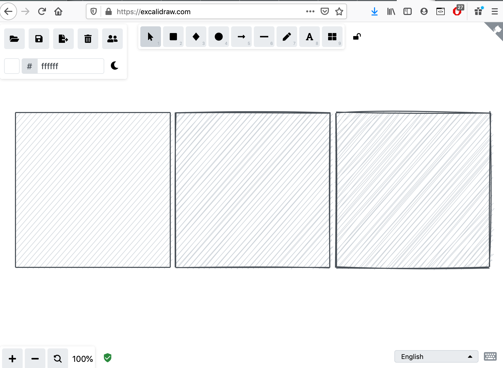

```{r setup, echo=FALSE, message=FALSE,warning=FALSE,out.width='100%'}
library(minixcali)
library(purrr)
library(knitr)
opts_chunk$set(message = FALSE, 
               warning=FALSE,
               fig.width = 7,
               fig.height = 3, 
               out.width='100%')

knitr::include_graphics('overview.png')
```

## The Excalidraw format

Excalidraw can import and export its scenes in json; the format consists of 5 top-level entries, of which the important one is `elements`, which is an array containing the description of each basic glyph in the scene.

```
{
"type": "excalidraw",
"version": 2,
"source": "https://excalidraw.com",
"elements": [
{
"type": "rectangle",
"fillStyle": "solid",
[...]
"groupIds": []
},
{
"type": "rectangle",
"fillStyle": "solid",
[...]
"groupIds": []
}
],
"appState": {
"viewBackgroundColor": "#ffffff",
"gridSize": null
}
}
```

Note that there doesn't appear to be a device size / viewport / viewbox. I'm also unsure what the units are; looking at the SVG export it seems to be the same default "px", i.e. 1/96th of an inch, i.e. about a quarter of a mm.

## Elements

- "type": "rectangle" or "ellipse" or "draw" or "text". There's also "line" and "arrow" but the difference is only relevant for the user interface.

Most attributes are pretty straight-forward,

- "fillStyle": "solid" or "hatch" or "cross-hatch"
- "strokeWidth": 1 or 2 or 4
- "strokeStyle": "solid" or "dashed" or "dotted"
- "roughness": 0 or 1 or 2 # degree of wiggliness
- "opacity": 0 to 100
- "angle": in radians
- "x": -156 # the origin appears to be the centre of the page?
- "y": -80  # units seem more or less like SVG's px
- "strokeColor": "#000000" # html codes
- "backgroundColor": "#ced4da"
- "width": 400 
- "height": 300
- "strokeSharpness": "sharp" or "round"

The following are for text (but it doesn't seem to hurt if irrelevant parameters are passed to another shape type),

- "text": "this is text"
- "fontSize": 36
- "fontFamily": 1 # "FG_Virgil.woff2" or 2 for "Cascadia.woff2" 
- "textAlign": "left"
- "verticalAlign": "top"
- "baseline": 3

Each glyph is assigned some identification,

- "seed": 233882977 # to generate unique random variations
- "id": "3HjMtdwNS5YZdRqmv3BFM" # unique ID, e.g. md5 hash of object
- "groupIds": [] # array of strings indicating glyph groupings
- "boundElementIds" — ids of (linear) elements that are bound to this element for connected glyphs

Finally the following attributes for collaboration,

- "version": integer that is sequentially incremented on each change. Currently used to reconcile elements during collaboration or when saving to server.
- "versionNonce": random integer that is regenerated on each change. Used for deterministic reconciliation of updates during collaboration, in case the versions are identical.
- "isDeleted": flag to keep track of deletes in collaboration

## Creating a simple scene

`minixcali` defines a very basic R6 class `ExcaliDocument` which initialises the 5 top-level nodes of the json object. Two methods are defined,

- `$add`, to add glyphs to the `elements` field
- `$export`, to save the object to a json file (via `jsonlite`)

The `$add` method simply appends glyph(s) to the list of elements. Each glyph needs to be a well-formed list of attributes, such as 

```{r, eval=FALSE}
list(type = "rectangle", 
     x = -407.242554, y = 0, 
     width = 44, height = 44, 
     angle = 0, 
     strokeColor = "#495057", 
     backgroundColor = "#ced4da", 
     fillStyle = "hachure", 
     strokeWidth = 1, 
     strokeStyle = "solid", 
     roughness = 1L, 
     opacity = 100L, 
     strokeSharpness = "sharp", 
     isDeleted = FALSE, 
     groupIds = list(), 
     boundElementIds = NA, 
     id = "2732dc14872d3709d5978813d7bf550c", 
     seed = 1260353516L, 
     version = 32L, 
     versionNonce = 784119031L)
```

`minixcali` provides 4 functions (`xkd_rectangle()`, `xkd_ellipse()`, `xkd_draw()`, `xkd_text()`) to generate such lists from the set of default parameters.


```{r test_shape, eval=TRUE}
str(xkd_text(text = "new label", 
             strokeColor = "#555555"))
```


To create multiple shapes at once it can be useful to create a list or data.frame of attributes, and use `purrr` functions to iterate over them,

```{r iterate, eval=TRUE}
a <- tibble::tribble(~x, ~y, ~width, ~height, ~roughness, ~backgroundColor,
             -300 ,   -80,   300,    300, 0, "#ced4da",
             10 ,   -80,   300,    300, 1, "#ced4da",
             320 ,   -80,   300,    300, 2, "#ced4da")

a$strokeWidth <- 2

d <- Excali_doc()
invoke(d$add, pmap(a, xkd_rectangle))
str(d$elements, max.level = 1)
```

We can the export the full tree to json and open it in Excalidraw,

```{r export, out.width="100%", echo=1}
d$export(file='testing.json')

```

The drawing may be edited at https://excalidraw.com/#json=5181621544157184,h3q8WL5-2HPBFjkjQeu5RA

## Lines 

`line`, `arrow` and `draw` elements (the difference is in the interaction with online tools; there's none from the JSON perspective) require a `points` attribute that encodes (x,y) node coordinates in an array structure. 

Say we have inherited some (x,y) coordinates representing a polygon from a drawing program; we can insert them into the `points` attribute and from there generate the scene as above. It is also possible to group multiple paths by giving them a common `group` attribute, as illustrated below. The resulting group can then be edited (moved, rotated, attribute changes, etc.) as one object in Excalidraw.

```{r kevin}
str(.kevin) # stored coords in the package under data/

d <- Excali_doc()

for (l in .kevin) {
  call <- c(l,
    list(
      groupIds = list(list("kevin")),
      strokeSharpness = "round",
      fillStyle = "solid",
      strokeWidth = 1L,
      roughness = 0L
    )
  )
  
  shape <- invoke(xkd_draw, call)
  d$add(shape)
  
}

d$export('drawing.json')
```

Drawing at https://excalidraw.com/#json=5903088405708800,72BcP2Ry6NHWbHEUpidg9w

```{r kevindrawing, out.width="40%", fig.align='center', echo=FALSE}
knitr::include_graphics('kevin.png')
```


