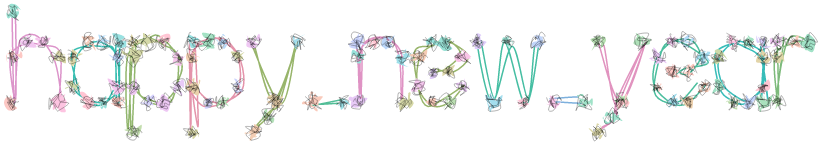

```{r setup, echo=FALSE, message=FALSE,warning=FALSE,out.width='100%'}
library(minixcali)
library(purrr)
library(knitr)
opts_chunk$set(message = FALSE, 
               warning=FALSE,
               fig.width = 7,
               fig.height = 4, 
               out.width='50%')

```


The `{gridfont}` package can convert a string of text into point coordinates for a single-stroke line font representation of the text. Note that the space character doesn't seem to have any strokes so for simplicity I replaced it with a `_`.

```{r, fig.width = 3, fig.height = 5}
library(minixcali)
library(gridfont)
let <- create_text_df('happy_new_year')
llet <- split(let, let$char_idx)
```

The structure consists of multiple nodes for each letter.

```{r data}
str(llet, list.len = 4)
```

We now proceed to build the Excalidraw scene one subpath at a time. We first add the polylines for each letter, then garnish them with points at the nodes.

```{r fun}


d <- Excali_doc()

scale <- 15
offset_x <- 100
offset_y <- 400

for (l in llet) {
  col <- sample(size = 1,
                hcl(seq(0, 360), c = 50, l = 70))
  
  xy <- cbind(scale * l$x, scale * (10 - l$y))
  xy[, 1] <- xy[, 1] - min(xy[, 1])
  xy[, 2] <- xy[, 2] - min(xy[, 2])
  
  
  stroke <- xkd_draw(
    x = scale * max(l$xoffset) - offset_x,
    y = scale * min(10 - l$y) - offset_y,
    width = diff(scale * range(l$x)),
    height = diff(scale * range(l$y)),
    strokeWidth = 1.5L,
    roughness = 2.5,
    strokeColor = col,
    strokeSharpness = "round",
    backgroundColor = "#40c057",
    fillStyle = "hachure",
    points = xy
  )
  
  d$add(stroke)
  
  for (ii in seq(1, nrow(xy))) {
    r <- runif(1, 4, 10)
    point <- xkd_ellipse(
      x = scale * max(l$xoffset[ii]) + xy[ii, 1] -
        0.5 * r - offset_x,
      y = scale * min(10 - l$y) + xy[ii, 2] -
        0.5 * r - offset_y,
      width = r,
      height = r,
      roughness = 4, 
    strokeSharpness = "sharp",
      fillStyle =  "solid",
      strokeWidth = 0.3,
      backgroundColor = sample(size = 1, 
                               hcl(seq(0, 360)))
    )
    
    d$add(point)
  }
  
  
}

d$export('gridfont.json')
```

You can see this drawing at:  https://excalidraw.com/#json=5831299101097984,dPakuLP9ATQCMtotejR0Vg


```{r drawing, out.width="100%", fig.align='center', echo=FALSE}

```


