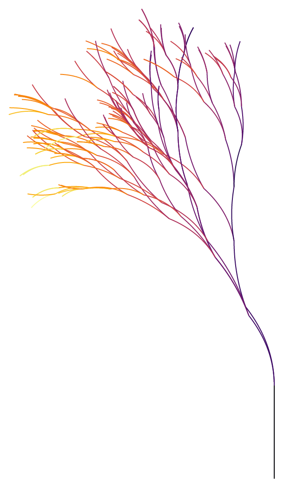

```{r setup, echo=FALSE, message=FALSE,warning=FALSE,out.width='100%'}
library(minixcali)
library(purrr)
library(knitr)
opts_chunk$set(message = FALSE, 
               warning=FALSE,
               fig.width = 7,
               fig.height = 4, 
               out.width='50%')

```

Let's add a [flametree](https://github.com/djnavarro/flametree) into Excalidraw.

## The R object

The flametree package uses ggplot2 for drawing, so we can piggyback the aesthetic mapping and simply extract point coordinates and colours in the plot's data.

```{r, fig.width = 3, fig.height = 5}
library(minixcali)
library(flametree)
library(ggplot2)

dat <- flametree_grow(seed = 4, time = 5) # data structure
img <- flametree_plot(tree = dat) # ggplot object
img
```

```{r data}
gb <- ggplot_build(img)

tr <- gb$data[[1]]
b <- split(tr, tr$group)
str(b, list.len = 3)
```

From there it's a relatively straight-forward process to add one branch at a time to the Excalidraw tree.

```{r fun}
d <- Excali_doc()


library(scales)

scale <- 100

for (ii in seq_along(b)) {
  s <- b[[ii]]
  
  r_x <- range(s$x)
  r_y <- range(s$y)
  
  m <- scale * cbind(s$x - r_x[1],-s$y - r_y[1])
  
  shape <- xkd_draw(
    x = scale * r_x[1],
    y =  scale * r_y[1],
    width = scale * diff(r_x),
    height = scale * diff(r_y),
    strokeWidth = 1,
    roughness = 0L,
    strokeSharpness = "round",
    groupIds = list("levelplot",
                    paste0('level-', ii)),
    fillStyle = "solid",
    strokeColor = s$colour[1],
    backgroundColor = s$colour[1],
    points = m)
  
  d$add(shape)
  
}

d$export('tree.json')
```

You can see this drawing at:  https://excalidraw.com/#json=5730260331003904,U-jtojw6AHcRuH_lw2P4ng

(with time=7 the tree is more interesting but Excalidraw struggles and doesn't offer a shareable link)

```{r drawing, out.width="50%", fig.align='center', echo=FALSE}

```


