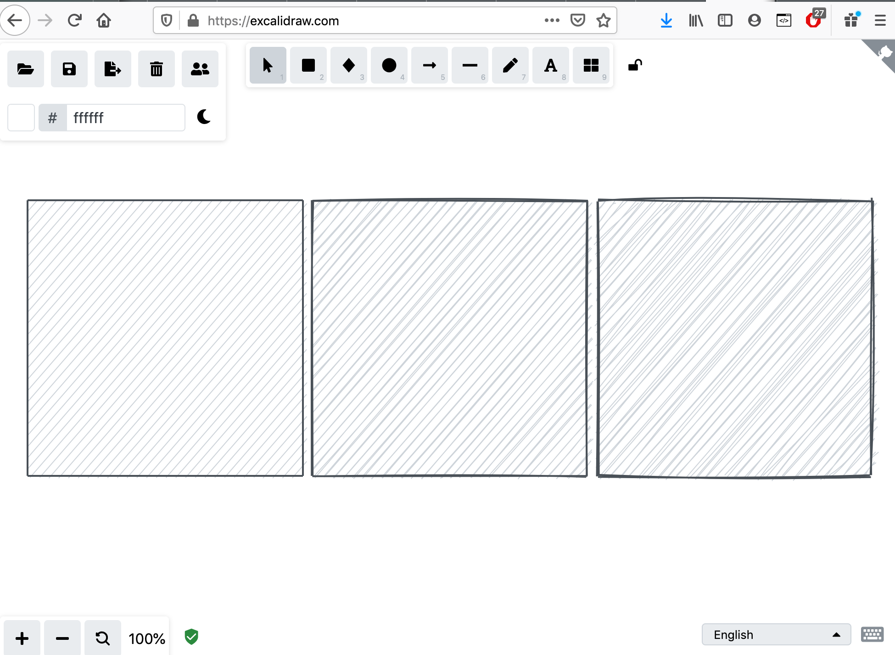
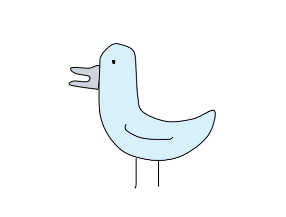

```{r setup, echo=FALSE, results='hide', message=FALSE}
library(minixcali)
library(purrr)
library(knitr)
opts_chunk$set(message = FALSE,
               fig.width = 7,
               fig.height = 3)
```

## The Excalidraw format

Excalidraw can import and export its scenes in json; the format consists of 4 top-level entries, of which the important one is `elements`, which is an array containing the description of each basic glyph in the scene.

```
{
"type": "excalidraw",
"version": 2,
"source": "https://excalidraw.com",
"elements": [
{
"type": "rectangle",
"fillStyle": "solid",
[...]
"groupIds": []
},
{
"type": "rectangle",
"fillStyle": "solid",
[...]
"groupIds": []
}
],
"appState": {
"viewBackgroundColor": "#ffffff",
"gridSize": null
}
}
```

Note that there doesn't appear to be a device size / viewport / viewbox. I'm also unsure what the units are; looking at the SVG export it seems to be the same default "px", i.e. 1/96th of an inch, i.e. about a quarter of a mm.

## Elements

- "type": "rectangle" or "ellipse" or "draw" or "text"

Most attributes are pretty straight-forward,

- "fillStyle": "solid" or "hatch" or "cross-hatch"
- "strokeWidth": 1 or 2 or 4
- "strokeStyle": "solid" or "dashed" or "dotted"
- "roughness": 0 or 1 or 2 # degree of wiggliness
- "opacity": 0 to 100
- "angle": in radians
- "x": -156 # the origin appears to be the centre of the page?
- "y": -80  # units seem more or less like SVG's px
- "strokeColor": "#000000" # html codes
- "backgroundColor": "#ced4da"
- "width": 400 
- "height": 300
- "strokeSharpness": "sharp" or "round"

The following are for text, but it doesn't seem to hurt if irrelevant parameters are passed to another shape type,

- "text": "this is text"
- "fontSize": 36
- "fontFamily": 1 # "FG_Virgil.woff2" or 2 for "Cascadia.woff2" 
- "textAlign": "left"
- "verticalAlign": "top"
- "baseline": 3

Each glyph is assigned some identification,

- "seed": 233882977 # to generate unique random variations
- "id": "3HjMtdwNS5YZdRqmv3BFM" # unique ID, e.g. md5 hash of object
- "groupIds": [] # array of strings indicating glyph groupings

It's unclear to me what the following keywords refer to, but it doesn't seem to matter so far,

- "boundElementIds": []
- "version": 160
- "versionNonce": 1571380943
- "isDeleted": false

## Creating a simple scene

`minixcali` defines a very basic R6 class `ExcaliDocument` which initialises the 4 top-level nodes of the json object. Two methods are defined,

- `$add`, to add glyphs to the `elements` field
- `$export`, to save the object to a json file (via `jsonlite`)

The `$add` method simply appends glyph(s) to the list of elements. Each glyph needs to be a well-formed list of attributes, such as 

```{r, eval=FALSE}
list(type = "rectangle", 
     x = -407.242554, y = 0, 
     width = 44, height = 44, 
     angle = 0, 
     strokeColor = "#495057", 
     backgroundColor = "#ced4da", 
     fillStyle = "hachure", 
     strokeWidth = 1, 
     strokeStyle = "solid", 
     roughness = 1L, 
     opacity = 100L, 
     strokeSharpness = "sharp", 
     isDeleted = FALSE, 
     groupIds = list(), 
     boundElementIds = NA, 
     id = "2732dc14872d3709d5978813d7bf550c", 
     seed = 1260353516L, 
     version = 32L, 
     versionNonce = 784119031L)
```

`g_element = function(...)` is a generic convenience function to create such lists by passing only those few parameters one wants to modify from the default values of a generic element.

To create multiple shapes at once it can be useful to create a data.frame of attributes, and use `purrr` function to iterate over each row,

```{r iterate, eval=TRUE}
a <- tribble(~x, ~y, ~width, ~height, ~roughness, ~backgroundColor,
             -300 ,   -80,   300,    300, 0, "#ced4da",
             10 ,   -80,   300,    300, 1, "#ced4da",
             320 ,   -80,   300,    300, 2, "#ced4da")

a$strokeWidth <- 2

d <- Excali_doc()
invoke(d$add, pmap(a, minixcali::g_element))
str(d$elements)
```

We can the export the full tree to json and open it in Excalidraw,

```{r export, out.width="100%"}
d$export(file='testing.json')

```

The drawing may be edited at https://excalidraw.com/#json=5181621544157184,h3q8WL5-2HPBFjkjQeu5RA

## Lines 

`line` and `draw` elements (not sure what the difference is, if any?) require a `points` attribute that encodes (x,y) node coordinates in an array structure. This messes a bit with the `tibble` approach above, probably requiring an understanding of list-columns. Failing that, I've sprinkled around random `list()` wrappers until things kind of worked.

Say we have inherited some (x,y) coordinates representing a polygon from a drawing program; we can insert them into the `points` attribute and from there generate the scene as above. It is also possible to group multiple paths by giving them a common `group` attribute, as illustrated below. The resulting group can then be edited (moved, rotated, attribute changes, etc.) as one object in Excalidraw.

```{r kevin, out.width="40%", fig.align='center'}
str(.kevin) # stored coords in the package under data/

d <- Excali_doc()

for(l in .kevin){
  new_stroke <- minixcali:::gly_glyph(type = 'line',  
                          x=l$x,
                          y=l$y,
                          width=l$width,
                          height=l$height,
                          attributes=list(list(roughness=1)))
  
  new_stroke$attributes = list(list(strokeWidth = 1L,
                                 roughness=0L,
                                 strokeSharpness= "round",
                                 groups = c("kevin"),
                                 strokeColor = l$strokeColor,
                                 backgroundColor = l$backgroundColor,
                                 fillStyle = "solid", 
                                 points = l$points))
  
  att <- new_stroke %>% unnest_wider(attributes)
  
  d$add(invoke(minixcali::g_element, att))
  
}

d$export('drawing.json')

```

Drawing at https://excalidraw.com/#json=5903088405708800,72BcP2Ry6NHWbHEUpidg9w


