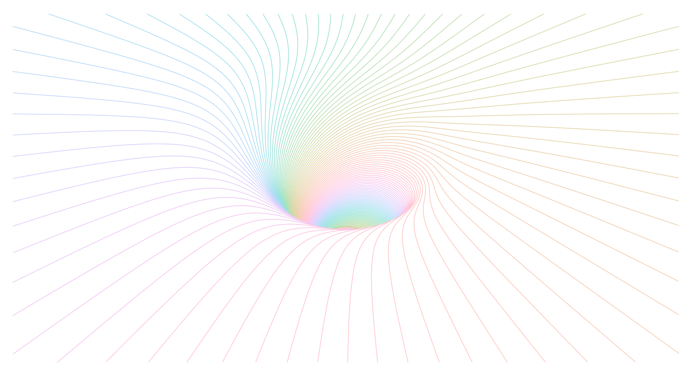

```{r setup, echo=FALSE, message=FALSE,warning=FALSE,out.width='100%'}
library(minixcali)
library(purrr)
library(knitr)
opts_chunk$set(message = FALSE, 
               warning=FALSE,
               fig.width = 7,
               fig.height = 3, 
               out.width='100%')

```

As an experiment we'll try to import the following svg output from [`ln`, a cool go program to create 3D line drawings for pen plotters](https://github.com/fogleman/ln).

```{r input, out.width="100%", fig.align='center', echo=FALSE}

```

The SVG file contains many polylines such as

```
<svg width="954" height="500" version="1.1" baseProfile="full" xmlns="http://www.w3.org/2000/svg" xmlns:xlink="http://www.w3.org/1999/xlink">
<g transform="translate(0,500) scale(1,-1)">
<polyline stroke="black" fill="none" points="465.28,191.39 465.93,191.59 465.93,191.59 466.57,191.78 466.57,191.78 467.22,191.98 467.22,191.98 467.87,...
```

## Getting point coordinates

The `{svgchop}` package interprets a subset of the SVG standard and breaks down objects (polygons, paths, etc.) into linear paths with simple (x, y) coordinates, which can then feed to the Excalidraw `draw` element. 


```{r svgchop}
# remotes::install_github('brodieG/svgchop')
library(svgchop)

b <- chop('fun.svg', steps = 3)[[1]]

str(b, max.level = 1, 
    give.attr = FALSE, list.len = 3)
str(b[[1]])
```

At this step it's useful to check that the output is a list of polygon paths; some SVG files can be more complex and return a different structure, e.g. nested lists of grouped elements. Here we can simply iterate over the list of paths and draw each one.

The only trick worth noting is that the (x,y) position should correspond to the bottom-left of the path, and the point coordinates are then relative to this origin. It can often be useful to give a general scaling factor between the original SVG coordinates and the Excalidraw scene (not necessarily using the same units).

```{r fun}
d <- Excali_doc()

library(scales)

cols <- hcl(seq(0, 360, length = length(b)))

scale <- 0.5

for (ii in seq_along(b)) {
  col <- cols[ii]
  s <- b[[ii]]
  
  r_x <- range(s[1, ])
  r_y <- range(s[2, ])
  
  m <- scale * cbind(s[1, ] - r_x[1], 
                     s[2, ] - r_y[1])
  
  shape <- xkd_draw(
    x = scale * r_x[1],
    y =  scale * r_y[1],
    width = scale * diff(r_x),
    height = scale * diff(r_y),
    strokeWidth = 0.5,
    roughness = 0L,
    strokeSharpness = "round",
    groupIds = list("levelplot", 
                    paste0('level-', ii)),
    fillStyle = "solid",
    strokeColor = col,
    points = m)
  
  d$add(shape)
  
}

d$export('fun.json')
```

(this seems quite big for excalidraw.com to handle, the browser may become a bit sluggish)

```{r drawing, out.width="100%", fig.align='center', echo=FALSE}

```

