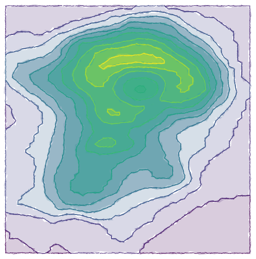

```{r setup, echo=FALSE, message=FALSE,warning=FALSE,out.width='100%'}
library(minixcali)
library(purrr)
library(knitr)
opts_chunk$set(message = FALSE, 
               warning=FALSE,
               fig.width = 7,
               fig.height = 4, 
               out.width='50%')

```

Let's import a volcano in Excalidraw; since there's no support for raster graphics, we'll use the `{isobands}` package to create polygonal contour lines.

## The R object

The `{isobands}` package takes a matrix of elevations and returns a number of contour lines at different heights. Adapting the documentation's example with the R volcano dataset,

```{r, fig.width = 3, fig.height = 5}
library(minixcali)
library(isoband)

m <- volcano
b <- isobands((1:ncol(m))/(ncol(m)+1), (nrow(m):1)/(nrow(m)+1), m, 10*(9:19), 10*(10:20))
str(b, list.len = 3)
```

We have a number of polygons with (x,y) coordinates to pass to `xkd_draw()` elements, but note that some of these polygons are not simply connected: this will be a problem as Excalidraw will join the pieces that should be disjoint. We'll therefore break down each path into separate groups using the `id` attribute returned by `isobands()`.

```{r data}
p <- split(data.frame(b[[2]]), b[[2]]$id)
str(p)
```

We now proceed to build the Excalidraw scene one subpath at a time, colouring the levels with both fill and colour.

```{r fun}

d <- Excali_doc()

library(scales)

fills <- scales::viridis_pal(alpha = 0.2)(length(b))
cols <- scales::viridis_pal(alpha = 1)(length(b))

scale <- 500

for(ii in seq_along(b)) {
  fill <- fills[ii]
  col <- cols[ii]
  
  l <- b[[ii]]
  spl <- split(data.frame(x = l$x, y = -l$y), l$id)
  
  for (s in spl) {
    r_x <- range(s$x)
    r_y <- range(s$y)
    
    m <- scale * cbind(s$x - r_x[1], s$y - r_y[1])
    
    shape <- xkd_draw(
      x = scale * r_x[1],
      y =  scale * r_y[1],
      width = scale * diff(r_x),
      height = scale * diff(r_y),
      strokeWidth = 0.8,
      roughness = 2L,
      strokeSharpness = "sharp",
      groupIds = list("levelplot", 
                 paste0('level-', ii)),
      fillStyle = "solid",
      strokeColor = col,
      backgroundColor = fill,
      points  = m
    )
    
    d$add(shape)
  }
}

d$export('volcano.json')
```

You can see this drawing at:  https://excalidraw.com/#json=6037869848166400,542JGip6v1DtWfHgYEvG5w


```{r drawing, out.width="50%", fig.align='center', echo=FALSE}

```


