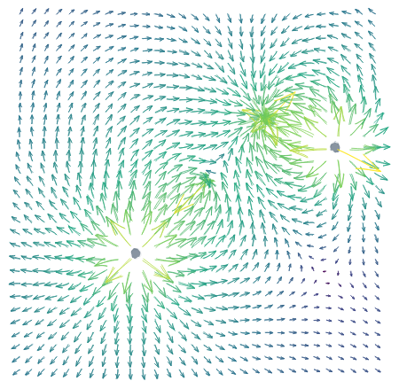

```{r setup, echo=FALSE, message=FALSE,warning=FALSE,out.width='100%'}
library(minixcali)
library(purrr)
library(knitr)
opts_chunk$set(message = FALSE, 
               echo=FALSE,
               warning=FALSE,
               fig.width = 7,
               fig.height = 4, 
               out.width='50%')

```

Let's simulate the electric field of a few points charges,

```{r, fig.width = 3, fig.height = 3, echo=FALSE}
library(minixcali)
library(ggplot2)
library(gridExtra)
library(dplyr)

x=seq(-1,2,length=200); y=seq(-1,2,length=200)
x2=seq(-0.87,1.8,length=30); y2=seq(-0.87,1.8,length=30)
xy <- expand.grid(x=x, y=y)
xy2 <- expand.grid(x=x2, y=y2)

model <- function(q = c(1,-1), x0=c(0, 1), y0=c(0,1), xy){
  E <- Ex <- Ey <- V <- 0
  for(ii in seq_along(q)){
    V = V + q[ii] * log((xy$x - x0[ii])^2 + (xy$y - y0[ii])^2)
    E =  E + q[ii] * (atan2((xy$y - y0[ii]), (xy$x - x0[ii])))
    Ex = Ex + q[ii] * (xy$x - x0[ii]) / ((xy$x - x0[ii])^2 + (xy$y - y0[ii])^2)^(1)
    Ey = Ey + q[ii] * (xy$y - y0[ii]) / ((xy$x - x0[ii])^2 + (xy$y - y0[ii])^2)^(1)
  }
  
  mutate(xy, V=V, E=E, Ex=Ex, Ey=Ey)
}

test <- model(q = c(5,-6, 5,-2), x0=c(0, 1, 1.5, 0.5), y0=c(0,1, 0.8, 0.5), xy=xy)

test2 <- model(q = c(5,-6, 5,-2), x0=c(0, 1, 1.5, 0.5), y0=c(0,1, 0.8, 0.5), xy=xy2)


charges <- data.frame(q = c(5,-6, 5,-2), 
                      x=c(0, 1, 1.5, 0.5), 
                      y=c(0,1, 0.8, 0.5), 
                      col = range(test$V, finite=TRUE)[c(1,2, 1,2)])

p <- ggplot(data = test, aes(x,y)) + 
  geom_raster(aes(fill=V)) +
  geom_contour(aes(z=V,colour=V), bins = 20) +
  geom_point(data=charges, aes(fill=col, size=abs(q)),shape=21) +
  geom_segment(data=test2, aes(x=x,y=y,
                               xend=x+Ex/150,yend=y+Ey/150,colour=log10(sqrt(Ex^2+Ey^2)))) +
  scale_fill_gradient2() +
  scale_colour_viridis_c() +
  guides(fill="none",colour="none",size="none") +
  theme_void() + coord_equal()

p
```

We can extract the data from the geom_segment plot layer 

```{r data}

gb <- ggplot_build(p)
str(gb$data[[4]])

tr <- gb$data[[4]]
b <- split(tr, seq(1,nrow(tr)))
str(b, list.len = 3)
```

and add arrows to an Excalidraw scene,

```{r fun}
d <- Excali_doc()


# first add charges
tr <- gb$data[[3]]
b1 <- split(tr, seq(1,nrow(tr)))

scale <- 150
scale2 <- 50
scale3 <- 2

for (ii in seq_along(b1)) {
  s <- b1[[ii]]
  charge <- xkd_ellipse(
    x = scale * s$x - 0.5*scale3*s$size,
    y =  scale * (-s$y+1)- 0.5*scale3*s$size,
    width = scale3*s$size,
    height = scale3*s$size,
    strokeWidth = 0.1,
    roughness = 1L,
    opacity = 50,
    strokeSharpness = "sharp",
    groupIds = list("charges",
                    paste0('col-', ii)),
    fillStyle = "solid",
    strokeColor = s$fill,
    backgroundColor = s$fill)
  
  d$add(charge)
  
}

library(scales)


for (ii in seq_along(b)) {
  s <- b[[ii]]
  # flip svg y axis
  s$y <- -s$y+1
  s$yend <- -s$yend+1
  
  m <- scale2 * cbind(c(0,s$xend - s$x),c(0,s$yend - s$y)) * 1 / ((s$xend - s$x)^2 + (s$yend - s$y)^2)^(0.3)
  
  shape <- xkd_arrow(
    x = scale * s$x,
    y =  scale * s$y,
    width = scale2 *abs(s$xend - s$x),
    height = scale2 *abs(s$yend - s$y),
    strokeWidth = 0.8,
    roughness = 1L,
    endArrowhead = "arrow",
    strokeSharpness = "sharp",
    groupIds = list("levelplot",
                    paste0('level-', ii)),
    fillStyle = "solid",
    strokeColor = s$colour[1],
    backgroundColor = s$colour[1],
    points = m)
  
  d$add(shape)
  
}


d$export('arrow.json')
```

You can see this drawing at:  https://excalidraw.com/#json=6202526680481792,xanZkzdhtsKWScXdt28sKQ


```{r drawing, out.width="50%", fig.align='center', echo=FALSE}

```


